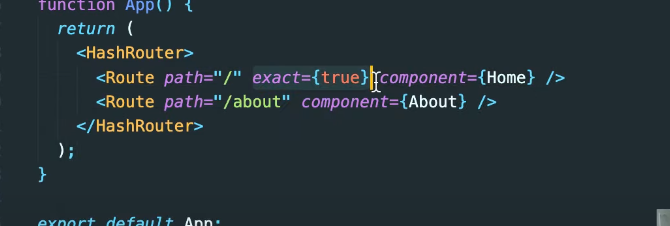
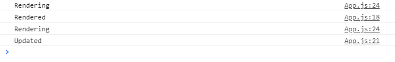

# Movie service with React

> React : Made from facebook. Used in spotify airbnb. Angular has angular specific grammar, but react has huge user population. Besides JSX, react is mostly javascript. 


### webpack


### babel


is replaced with create-react-app since 2016


`npm install npx -g`

install npx on global

No longer needed after newer node


`npx create-react-app movie_app`

`npm start`


manifest.json is for PWA


app.js will go into index.html's root


virtual DOM


REACT vs REACT DOM

React makes components

React DOM interacts with DOM


Why do we use react?

HTML JS CSS bind it to one component

use babel webpack to bind it. 

react create app acts as vue CLI.


F12 vs ctrl U


### Component

```js
//potato.js

import React from "react";
// This line is crucial to let React know this is a component

// Uppercase for the first letter
function Potato() {
  return <h3>Potato</h3>;
}

export default Potato;

```


Component  : function that returns HTML. Looks like <App />

React application can only render one component which is <App />. Inside App.js you can put more components.


### JSX

Combination between HTML and JS. It is the only thing very custom for react, the rest is JS. 

Why use JSX? 


```js
<Food fav="kimchi" />
// Food=component prop=fav value-"kimchi"
```


```javascript
function Food(props){
	console.log(props)
	// gives us the props and values
	return <h1> I like props.fav </h1>
}

//same thing as above
//props.fav = {fav}
function Food({fav}){
    console.log(fav)
    return <h1> I like {fav} </h1>
}
```


### map function

```js
friends = ['ki', 'han', 'gu']
friends.map(friend=>{
    return friend + "!"
})

console.log(friends)
//friends = ['ki!', 'han!', 'gu!']
```

Iterate through iterables and apply callback functions and then return array of the iterables. 


Runtime 환경에서 props에 대해서 typecheck 을 한다. 


### typecheck


### PropTypes

`npm i prop-types`

Tells us if we're getting all the props that we need and helps debugging. 

```js
import PropTypes from "prop-types"

Food.propTypes = {
  name: PropTypes.string.isRequired,
  image: PropTypes.string.isRequired,
  rating: PropTypes.number.isRequired,
};

```

Error : if wrong type. If it's empty? No error. For better code quality.


### MOBILE APPS

1. Responsive web with simple functions.

2. Android : Java + Kotlin, IOS : Swift. 최적화에는 훨씬 유리하다. 

3. React Native : Use JS to control Android and IOS.  브릿지를 연결한다. 

   EXPO 라는 프레임워크가 마음이 편하다. 


### Why React Native

One language to use on diverse environments.


### Deploy


```js
// package.json

.
.
.
    "development": [
      "last 1 chrome version",
      "last 1 firefox version",
      "last 1 safari version"
    ]
  },
  // Add homepage part
  "homepage": "https://keithkwon.dev/movie_app_react/"
}

```


`npm i gh-pages`

```js
//package.json

.
.
.
  "scripts": {
    "start": "react-scripts start",
    "build": "react-scripts build",
    "test": "react-scripts test",
    "eject": "react-scripts eject",
    "deploy": "gh-pages -d build",
    "predeploy":"npm run build"
  },
     

```

``npm run build`


## Router

`npm i react-router-dom`





every route in router get some props by default.


### Hash router vs Browser router


### Dynamic Data

Changes. Props are no good. 


```js
//First, learn about class components
import React from "react";

class App extends React.Component {
  render() {
    return <h1>I am a class component </h1>;
  }
}

export default App;

```

Class components do not `return` they `render` . Inside `render` they have `return`. 

It's extended from React component and put inside a render method. 

Class component have something called `state`.


do not change state directly from function!

Because it will not refresh the render function. 

You want to render again every time state changes. 

setState() will change the value and render again. And it will change very quick. 


```js
import React from "react";

class App extends React.Component {
  state = {
    count: 0,
  };
  add = () => {
//    this.setState({ count: this.state.count + 1 });
    // This is a better way. Why? 
    this.setState({ current => count: current.count + 1 });
  };
  minus = () => {
    this.setState({ count: this.state.count - 1 });
  };

  render() {
    return (
      <div>
        <h1>The number is {this.state.count} </h1>
        <button onClick={this.add}>add</button>
        <button onClick={this.minus}>minus</button>
      </div>
    );
  }
}

export default App;

```


### Component Life Cycle

### #mounting #updating #unmounting

Until now render() was the only function from React we used. But they have more.

Life cycle method is how react component creates and destroys components. 

1. Mouting
   - constructor() : JS 
   - render()
   - componentDidMount()
2. Updating
   - render()
   - componentDidUpdate()
3. Unmounting
   - componentWillUnmount()


```js
import React from "react";

class App extends React.Component {
  componentDidMount() {
    console.log("Rendered");
  }
  componentDidUpdate() {
    console.log("Updated");
  }
  render() {
    console.log("Rendering");
    return (
      <div>
        <h1> Hello World</h1>
      </div>
    );
  }
}

export default App;

```




```js
import React from "react";

class App extends React.Component {
  state = {
    isLoading: true,
  };
  componentDidMount() {
    setTimeout(() => {
      this.setState({ isLoading: false });
    }, 6000);
  }
  render() {
    //    return <div> {this.state.isLoading ? "Loading" : "Ready" </div>
    // Modern JS
    const { isLoading } = this.state;
    return <div> {isLoading ? "Loading" : "Ready"} </div>;
  }
}

export default App;

```


changes to


in 6 seconds. 


### mount vs render

1. "Rendering" is any time a function component gets called (or a class-based `render` method gets called) which returns a set of instructions for creating DOM.
2. "Mounting" is when React "renders" the component for the first time and actually builds the initial DOM from those instructions.


### axios vs fetch

`npm i axios`

axios is the chocolate fetch is the nuts


```js
// aync await
  getMovies = async () => {
    const movies = await axios.get("https://yts.mx/api/v2/list_movies.json");
  };

  componentDidMount() {
    this.getMovies;
  }
```


### socket


## websocket vs socket io


### babel

Translating multi version JS to one standard version. 


### Webpack

Integrating multiple js, css, html into one file. Bundler. 

webpack is an open-source JavaScript module bundler. 

vue-cli does the babel and webpack job at the back-end.


### importing components

```js
//Movie.js

import React from "react";
import PropTypes from "prop-types";

function Movie({ id, year, title, summary, poster }) {
  return <h1>{title}</h1>;
}

Movie.propTypes = {
  id: PropTypes.number.isRequired,
  year: PropTypes.number.isRequired,
  title: PropTypes.string.isRequired,
  summary: PropTypes.string.isRequired,
  poster: PropTypes.string.isRequired,
};

export default Movie;

```


```js
//App.js

import Movie from "./Movie";
.
.
.
 render() {
    const { isLoading, movies } = this.state;
    return (
      <div>
        {" "}
        {isLoading
          ? "Loading"
          : movies.map((movie) => {
              return (
                <Movie
                  key={movie.id}
                  id={movie.id}
                  year={movie.year}
                  title={movie.title}
                  summary={movie.summary}
                  poster={movie.medium_cover_image}
                />
              );
            })}{" "}
      </div>
    );
  }
}
.
.
.
```

